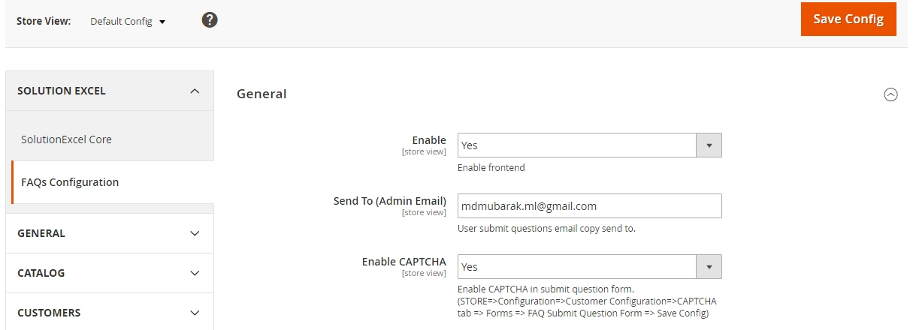
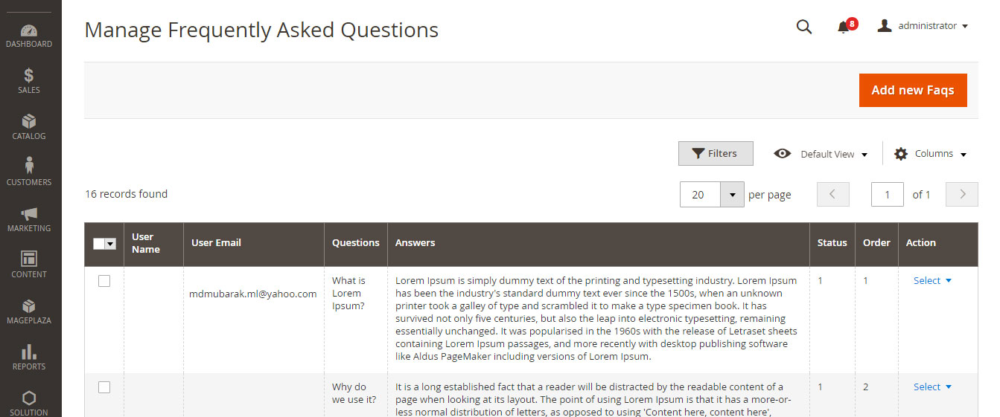
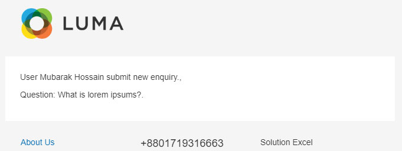
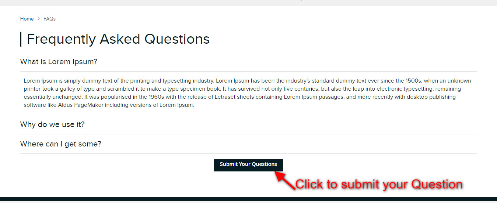
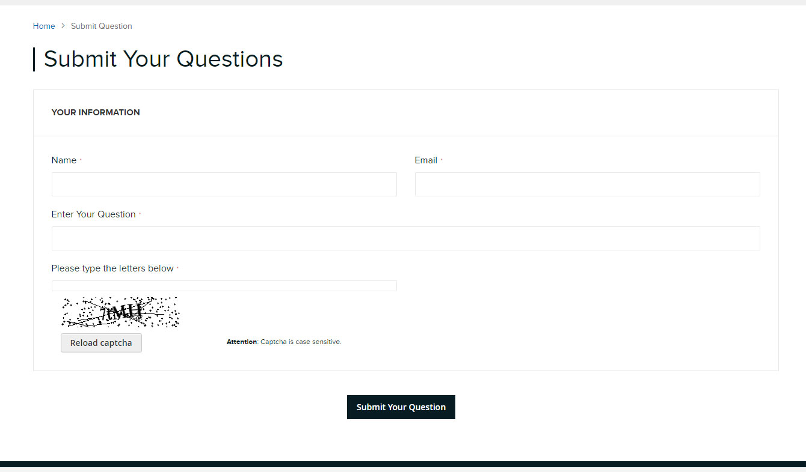
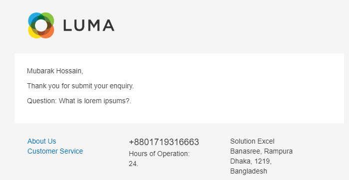

# Frequently Asked Questions (Faqs) Free - magento2-faqs 
Magento 2 Frequently Asked Questions (Faqs) free extension.

#### Compatible With:
Magento ver 2.2.3

## Available Features:
* Faqs link on TopLinks and Footer links section.
* Faqs list page Questions and Answer with jQuery Accordion 
* Customer can submit own question from Submit Question page (frontend form)
* Submit question form has CAPTCHA field with backend control ensble/disable.
* Customer receive a confirmation email when submit own question.
* Admin able to Enable/Disable frontend featured from system configuration.
* Admin receive a notification email when a user submit any question.
* Admin can update question answer and publish for showing frontend.
* Settings STORE => SOLUTION EXCEL => Faqs configuration
* Manage Faqs STORE => SOLUTION EXCEL => Manage Faqs
* Enable CAPTCHA STORE => Configuration => Customer Configuration => CAPTCHA tab

## Faqs backend screen shot

## Faqs frontend screen shot

## Installation
##### Manually (not recommended)
 * Download Faqs Extension
 * Unzip the magento2-faqs-master.zip file
 * Create a folder {Magento 2 root}/app/code/Solutionexcel
 * Copy all folder (Core and Faqs) to Solutionexcel folder

#### Step 2 - Enable/Install via command line
 * php bin/magento module:enable Solutionexcel_Core (If already have Core extension then skip it)
 * php bin/magento module:enable Solutionexcel_Faqs
 * php bin/magento setup:upgrade
 * php bin/magento cache:flush

If you have any inquiry please contact with me via email or skype.
* Email: [info@solutionexcel.com](mailto:info@solutionexcel.com)
* Skype: solutionexcel
* Web: [Solution Excel](https://www.solutionexcel.com/)
